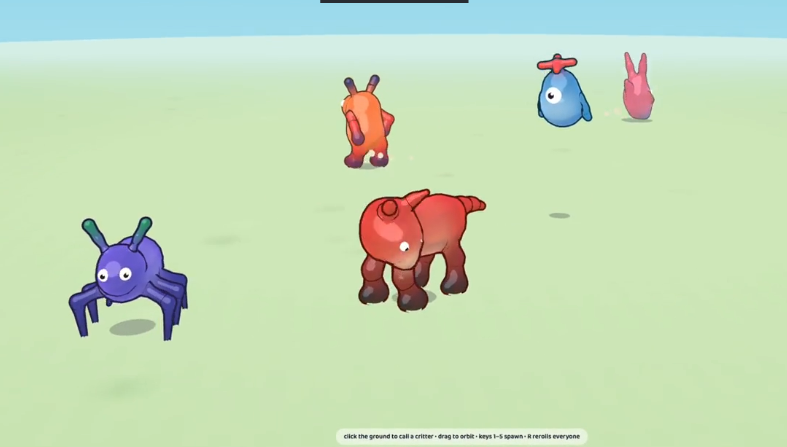

# critters

Procedural creature sandbox in one static HTML page. No assets, no rigs, no animation clips:
every creature is a pile of primitive shapes fused into one seamless toon body by an
**SDF blend-shell** vertex shader, animated 100% procedurally. Three.js via CDN; open
`index.html` and it runs.



## Play it

**[tront.xyz/critters](https://tront.xyz/critters/)** works on desktop + phone, gamepad optional.

## Credits & provenance

This is a from-scratch replica of **GOOBERS (seamless blend shell critters)** by
u/AntiqueFeedback7447: [Reddit post](https://redd.it/1umiurs) (r/aigamedev, July 2026),
[X post](https://x.com/Nevsved/status/2073687955265171924). They published the technique
writeup ("SDF blend-shell") and the prompt they used, but never released their code;
everything here was written clean-room against that public description plus screenshots
of the thread. I disclosed this clone in the original thread (u/MTOMalley).

Their published prompt, for the record: "Build with Three.js and explore a new
procedurally generated 3D character style: ragdoll-like characters composed of primitive
shapes that look like one seamless body via a custom, mobile-performant tech-art/shader
solution, with toon styling, plus a procedural animation system that works for 2-legged,
any-legged, no-legged (hopping) and flying characters with arms."

Visual prior art: [RujiK the Comatose](https://www.youtube.com/@RujiKtheComatose),
whose pre-AI procedural creature work this style strongly resembles (spotted by the
thread, credited gladly).

## Controls

- **click or tap the ground**: nearest critter comes to the spot
- **click or tap a critter**: pet it (happy squash, hearts, chirp)
- **drag**: orbit camera (wheel or pinch zooms; touch works everywhere)
- **keys 1–6 or the on-screen buttons**: spawn biped / quadruped / multiped / hopper / flyer / serpent
- **R or the dice button**: rerolls everyone (new random recipes, same archetypes)
- **link button**: copies a share link for the nearest critter (full recipe in the URL; the scene seed is always in the URL too)
- **speaker button**: procedural chirp sounds on/off
- **? button**: about + credits

### Xbox controller

Plug in a pad (press any button so the browser exposes it) and you possess the nearest
critter — a soft ring marks yours. Unplug and it goes back to being an AI critter;
replug and you're back in. Detection uses connect/disconnect events plus per-frame
`navigator.getGamepads()` scanning, so hot-plugging works everywhere.

- **left stick** — run (camera-relative; walkers gait, hoppers chain hops, flyers bank)
- **A** — jump (walkers bunny-hop, hoppers big-hop, flyers bounce upward)
- **LB / RB** — switch which critter you control
- **right stick** — orbit the follow camera, **triggers** zoom
- Mouse and keyboard keep working the whole time

## How it works: SDF blend-shell

- Every body part is a **round cone** (capsule with two radii; spheres are the degenerate
  case). A creature is 10–32 of them, described by uniform arrays.
- Each primitive contributes a stretched unit-sphere mesh, all merged into ONE
  BufferGeometry (one draw call per creature + one for the outline). A vertex attribute
  marks which primitive each vertex belongs to.
- The vertex shader rebuilds the vertex from the primitive's *current* endpoints (the CPU
  animator updates them every frame), then **projects it onto the smooth-min union SDF of
  all primitives** (Newton steps along the field gradient). Where shapes overlap, vertices
  from both shapes converge onto the same blended isosurface — seams cease to exist.
- Normals come from the SDF gradient, so lighting flows continuously across joints.
  Colors and gloss blend by smooth-min proximity: soft gradients at every join, for free.
- Per-primitive blend radius: thin parts (antennae, propeller blades) get a small `k` so
  they don't dissolve into the body. Deeply buried vertices tuck under the skin instead of
  projecting out. Embedded color decals (belly patches, spots) are flagged to skip the
  outline pass.
- **Outlines**: the same geometry drawn again with flipped culling, projected onto the SDF
  *offset* surface (`iso = +w`) instead of inflating along vertex normals — clean toon
  outlines even in concave joints, tinted per-vertex from the body color.
- Cost is per-vertex, not per-pixel. No raymarching, no skinning, rigid transforms only —
  squash & stretch is applied to the primitive endpoints/radii, so the SDF stays valid.

## Animation (all procedural)

- **Walkers** (2 / 4 / 6 / 8 legs): analytic two-bone IK per leg. Phase-driven gait while
  moving (alternating pairs, trot diagonals, tripod/wave ripple) plus reactive stepping
  when idle or turning. Predictive foot placement, arc swings, dust puff + body dip on
  plant. Knee pole vectors differ per archetype (spiders bend up-and-out).
- **Hopper**: state machine — idle breathing → crouch (anticipation squash) → ballistic
  launch (stretch) → landing squash + dust ring.
- **Flyer**: hover bob + drift, banks into turns, spinning propeller primitives.
- **Ropes**: tails / ears / antennae are verlet chains whose segments are SDF primitives —
  physics ropes that stay seamlessly fused while flopping.
- **Eyes**: googly meshes riding the head frame; pupils track the move target, blinks,
  occasional cyclops.

## Recipes

A creature is a small JSON blob (archetype, size, palette, proportions, decorations, gait).
Every spawn logs its recipe to the console. Spawn your own:

```js
CRITTERS.spawnRecipe({
  archetype: 'quadruped', size: 1.1,
  palette: { /* base/belly/limb/dark/accent/spot as [r,g,b], outline as hex */ },
  body: { len: 1.0, r1: 0.4, r2: 0.37, y: 0.6 },
  head: { r: 0.27, len: 0.38, neckY: 0.8, neckZ: 0.5, neckLen: 0.3 },
  legs: { count: 4, l1: 0.36, l2: 0.36, thick: 0.14, footR: 0.1, k: 0.11,
          hipX: 0.22, hipY: 0.55, hipZ0: 0.33, hipZ1: -0.34, stanceX: 0.3, stanceZ: 1 },
  tail: { segs: 3, len: 0.75, r0: 0.12, r1: 0.04, x: 0, y: 0.72, z: -0.52 },
  eyes: { count: 2, r: 0.07, spread: 0.18, y: 0.06, z: 0.14 },
  motion: { speed: 1.5, tempo: 1.0, bob: 0.035 },
}, 0, 0);
```

The 5 featured recipes at the top of the file reproduce the reference cast; `genRecipe()`
rolls endless random ones within archetype constraints.

## Debug API (`window.CRITTERS`)

`spawn(type)` · `spawnRecipe(json, x, z)` · `reroll()` · `frame(i, dist)` camera close-up ·
`pause()` / `resume()` / `step(ms)` · `stats()` → `{critters, fps, prims}` · `list`

`?seed=N` in the URL makes rerolls/spawns deterministic.

## Files

- `index.html` — everything (CSS + JS + GLSL inline)
- `DESIGN.md` — design/spec notes
- `docs/` — design specs and implementation plans
- `tools/verify.mjs` — headless-Chrome CDP verification harness
- `reference/` — target screenshots the look was matched against
- `verify/` — headless-Chrome verification captures
